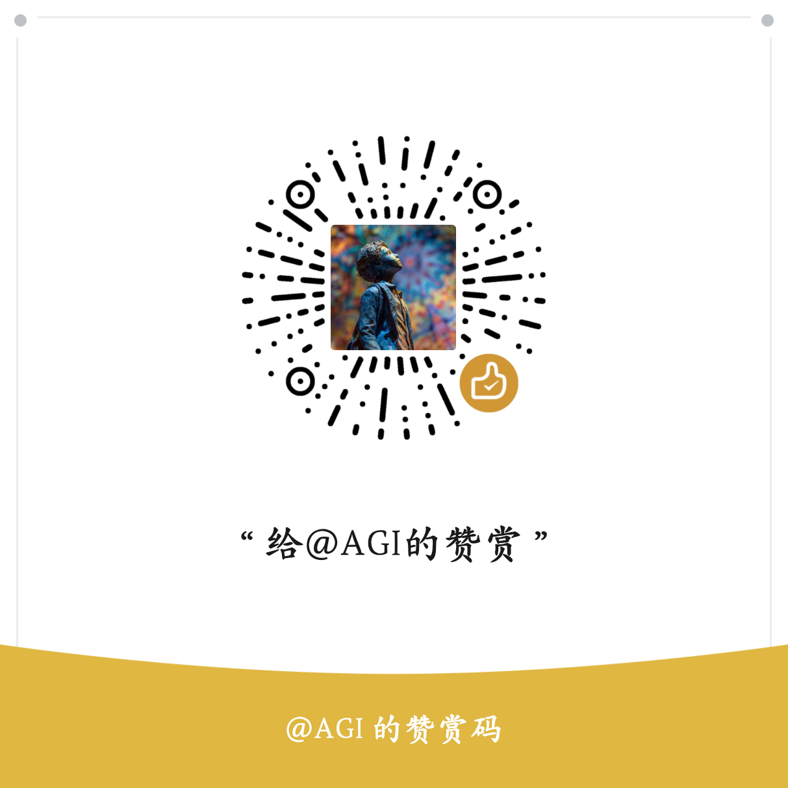
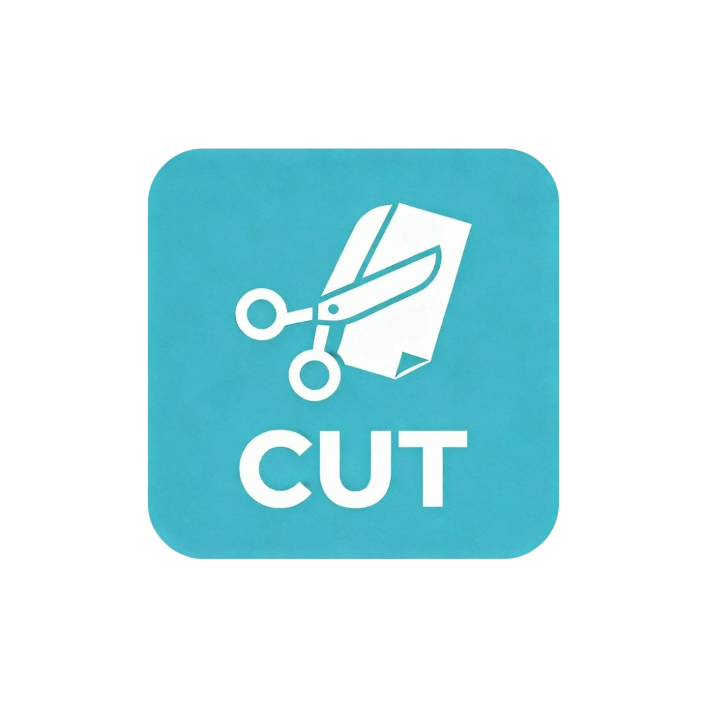

<<<<<<< HEAD
# 剪一剪 - 表情包分割器 ✂️


<p align="center">
  
</p>

<p align="center">
  一款功能强大的表情包分割工具，采用现代化UI设计，支持自定义分割、实时预览、批量处理等功能。
</p>

<p align="center">
  <a href="#features">特性</a> •
  <a href="#screenshots">截图</a> •
  <a href="#installation">安装</a> •
  <a href="#usage">使用</a> •
  <a href="#tech-stack">技术栈</a> •
  <a href="#development">开发</a> •
  <a href="#license">许可证</a>
</p>

## 🌟 项目亮点

✂️ **专业表情包处理工具** - 专为表情包制作爱好者设计，轻松将长图分割成完美表情包

🎨 **现代化UI设计** - 基于Fluent Design理念，提供流畅的用户体验

⚡ **高性能处理** - 支持批量处理，实时预览，智能优化算法

📱 **多格式支持** - 支持JPG、PNG、BMP、WebP等多种图片格式

## <a name="features"></a>✨ 核心功能

### 🖼️ 智能预览与编辑
- **双屏实时预览** - 原图与分割效果对比展示
- **任意角度旋转** - 鼠标拖拽旋转，支持精确角度调整
- **自定义分割** - 支持1-18行列自定义分割
- **智能布局检测** - 自动识别四宫格/九宫格布局

### 📦 批量处理
- **多文件支持** - 一次处理最多10个文件
- **进度实时显示** - 清晰展示处理进度和状态
- **错误容错机制** - 单个文件失败不影响整体处理

### ⚙️ 灵活导出
- **多种输出格式** - 支持PNG（透明背景）和JPG（小文件体积）
- **自定义路径** - 支持原图目录或自定义输出路径
- **智能命名** - 自动添加序号前缀，避免文件名冲突

### 🧠 智能边缘线识别（新增）
- **多种检测算法** - 基础、增强、自适应等多种边缘检测器
- **智能模式选择** - 自动、激进、保守三种处理模式
- **批量处理支持** - 一次性处理多张图片的边缘线

## <a name="screenshots"></a>📸 应用截图

<p align="center">
  
  <br>
  <em>现代化三栏布局界面</em>
</p>

<p align="center">
  
  <br>
  <em>实时分割预览效果</em>
</p>

## <a name="installation"></a>📥 安装指南

### 系统要求
- Windows 7/8/10/11
- Python 3.8 或更高版本
- 50MB 可用磁盘空间

### 安装步骤

1. **克隆仓库**
```bash
git clone https://github.com/your-username/jianyijian.git
cd jianyijian
```

2. **安装依赖**
```bash
pip install -r requirements.txt
```

3. **启动应用**
```bash
# 方式1：使用启动脚本（推荐）
双击 "启动剪一剪.bat"

# 方式2：命令行启动
cd "d:\表情包工具\剪一剪"
python src/main_qt.py
```

## <a name="usage"></a>🚀 快速使用

1. **添加图片** - 点击"添加文件"按钮选择要处理的图片
2. **调整设置** - 在预览区域调整分割行列数和旋转角度
3. **开始处理** - 点击"开始处理"按钮执行分割操作
4. **查看结果** - 处理完成后点击"打开输出"查看分割结果

## <a name="tech-stack"></a>🛠️ 技术栈

- **开发语言**: Python 3.8+
- **GUI框架**: PyQt6（现代化界面）
- **图像处理**: Pillow (PIL) + OpenCV
- **配置管理**: JSON
- **打包工具**: cx_Freeze (可选)

## <a name="development"></a>💻 开发指南

### 项目结构
```
剪一剪/
├── src/                    # 源代码目录
│   ├── main_qt.py         # 主程序入口
│   ├── ui/                # UI模块
│   │   └── main_window_qt.py  # 主窗口实现
│   ├── core/              # 核心功能模块
│   │   ├── image_processor.py  # 图像处理
│   │   ├── file_manager.py     # 文件管理
│   │   ├── settings_manager.py # 配置管理
│   │   └── language_manager.py # 多语言支持
│   │   └── edge_detection/     # 边缘检测模块
│   └── utils/             # 工具模块
│       └── validators.py       # 参数验证
├── assets/                # 资源文件
├── requirements.txt       # 依赖列表
└── 启动剪一剪.bat         # 启动脚本
```

### 调试和测试

#### 启动诊断
```bash
python debug_start.py
```

#### 简化启动测试
```bash
python test_launch.py
```

### 打包应用
```bash
# 使用cx_Freeze打包
pip install cx_Freeze
python setup.py build
```

## 🤝 贡献

欢迎提交Issue和Pull Request来帮助改进项目！

### 开发计划
- [ ] 支持更多图片格式
- [ ] 添加撤销/重做功能
- [ ] 实现云存储集成
- [ ] 开发移动端版本
- [ ] 添加AI智能分割

## <a name="license"></a>📄 许可证

本项目采用MIT许可证，详情请见[LICENSE](LICENSE)文件。

## 📧 联系方式

- **邮箱**: byilb3619b@gmail.com
- **GitHub Issues**: [提交问题](https://github.com/your-username/jianyijian/issues)

## 🌟 支持项目

如果你喜欢这个项目，请考虑：

1. 给仓库点个⭐Star
2. 分享给你的朋友和同事
3. 贡献代码或提出改进建议
4. 反馈使用中的问题

<p align="center">
  Made with ❤️ by 表情包工具开发团队
</p>
=======
# -Cut-a-little-
裁剪图像，裁剪表情包(Crop images, crop meme images)
>>>>>>> 7dfce2a4a375cc040cc00d0745506bde3d140aa3
