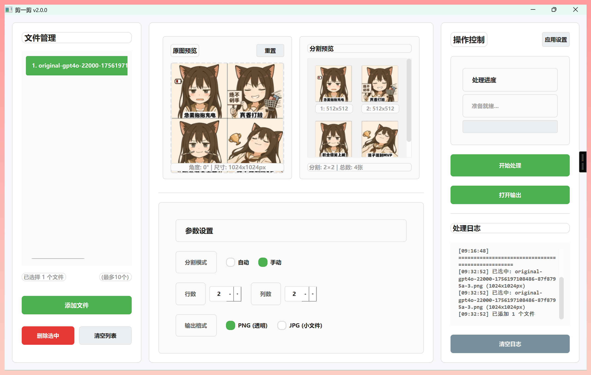

# 贡献指南

感谢您对剪一剪项目的关注！我们欢迎任何形式的贡献。

## 如何贡献

### 报告问题
如果您发现了bug或有功能建议，请在GitHub上创建Issue：
1. 检查是否已存在相关Issue
2. 使用清晰的标题和详细的描述
3. 提供重现步骤（如果是bug）
4. 添加截图或日志（如果适用）

### 提交代码
1. Fork项目到您的GitHub账户
2. 创建功能分支 (`git checkout -b feature/AmazingFeature`)
3. 提交更改 (`git commit -m 'Add some AmazingFeature'`)
4. 推送到分支 (`git push origin feature/AmazingFeature`)
5. 创建Pull Request

## 开发环境设置

### 系统要求
- Windows 7/8/10/11
- Python 3.8或更高版本

### 安装步骤
```bash
# 克隆仓库
git clone https://github.com/kscz0000/-Cut-a-little-.git
cd -Cut-a-little-

# 安装依赖
pip install -r requirements.txt

# 运行应用
python src/main_qt.py
```

## 代码规范

### Python代码风格
- 遵循PEP 8代码规范
- 使用4个空格进行缩进
- 函数和类需要添加文档字符串
- 变量和函数名使用小写字母和下划线

### 提交信息规范
- 使用英文编写提交信息
- 首字母大写
- 使用祈使句（如"Add feature"而不是"Added feature"）
- 在适当情况下添加前缀：
  - `feat:` 新功能
  - `fix:` Bug修复
  - `docs:` 文档更新
  - `style:` 代码格式调整
  - `refactor:` 代码重构
  - `test:` 测试相关
  - `chore:` 构建过程或辅助工具的变动

## 分支策略与保护规则

### 分支模型
我们采用GitHub Flow分支模型：
- `main` 分支是生产分支，始终保持可部署状态
- 所有功能开发都在特性分支上进行
- 特性分支命名规范：`类型/简短描述`（例如：`feature/image-crop-enhancement`）

### 分支保护
`main` 分支已启用以下保护规则：
- 需要Pull Request进行合并
- 至少需要一名审查者批准
- 要求状态检查通过

## 测试

### 运行测试
```bash
# 运行启动诊断
python debug_start.py

# 运行简化启动测试
python test_launch.py
```

### 添加新测试
- 为新功能添加单元测试
- 确保所有测试通过后再提交

## 项目结构

```
剪一剪/
├── src/                    # 源代码
│   ├── core/              # 核心模块
│   ├── ui/                # 用户界面
│   └── utils/             # 工具函数
├── tests/                 # 测试文件
├── docs/                  # 文档
└── assets/                # 资源文件
```

## 应用界面示例




## 问题和讨论

如果您有任何问题或建议，可以通过以下方式联系我们：
- 创建GitHub Issue
- 发送邮件到项目维护者